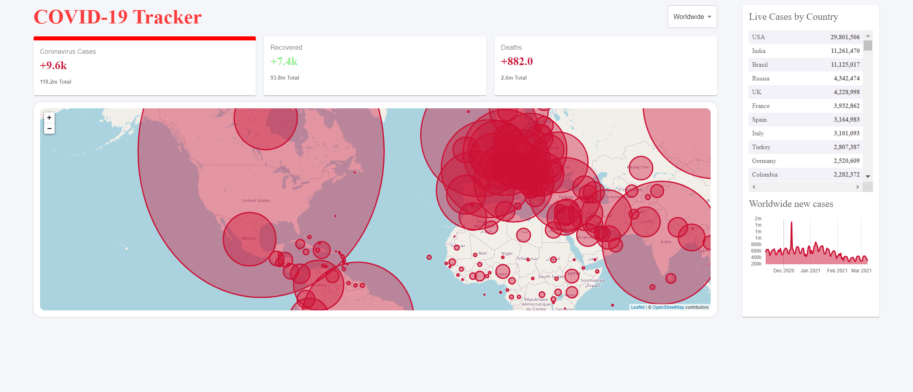

# COVID-19 TRACKER

This application is built by React, React Hook with the addition of Chart.js, Material UI. 

I used the API, https://disease.sh/v3/covid-19/all. This API will fetch all data into my React application.

Below is the Covid-19 Tracker image:

